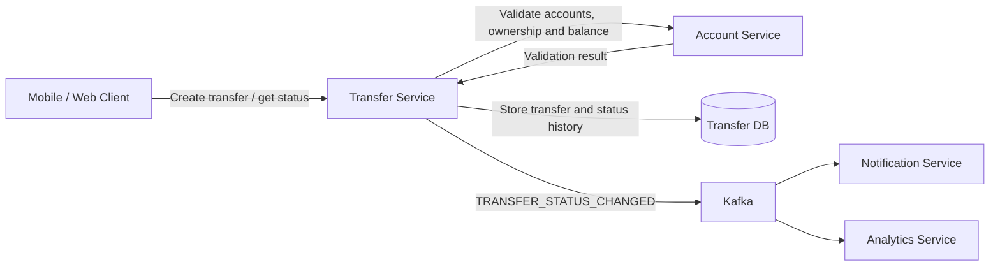

# System Context

The P2P transfer flow is centered around Transfer Service.

## Responsibilities

**Transfer Service**

Owns the transfer lifecycle, validates transfer requests and stores transfer state.

**Account Service**

Owns account information and balances. It is responsible for checking account existence, account ownership and available funds.

**Transfer DB**

Stores transfers and their status history. Account balances are not stored here.

**Kafka**

Distributes transfer status events to interested consumers.

**Notification Service**

Can use transfer events to notify clients about transfer results.

**Analytics Service**

Can consume transfer events for reporting and analytics.

## Service Boundary

Transfer Service stores account identifiers but does not own account data.

This means that `sender_account_id` and `recipient_account_id` are not foreign keys to a local `accounts` table. Account validation is performed through Account Service.
