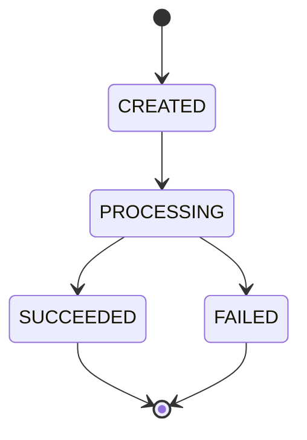

# Transfer State Diagram

## Transfer Lifecycle

## State Descriptions

### CREATED
The transfer has been created and stored in the system, but processing has not started yet.

### PROCESSING
The transfer is currently being processed.

### SUCCEEDED
The transfer has been completed successfully.

### FAILED
The transfer could not be completed.

## Allowed Transitions

| Current State | Next State | Description |
|---|---|---|
| CREATED | PROCESSING | Transfer processing starts |
| PROCESSING | SUCCEEDED | Transfer completed successfully |
| PROCESSING | FAILED | Transfer processing failed |

## Invalid Transitions

The following transitions are not allowed:

- `SUCCEEDED -> PROCESSING`
- `SUCCEEDED -> FAILED`
- `FAILED -> PROCESSING`
- `FAILED -> SUCCEEDED`
- `CREATED -> SUCCEEDED`
- `CREATED -> FAILED`

`SUCCEEDED` and `FAILED` are terminal states.
